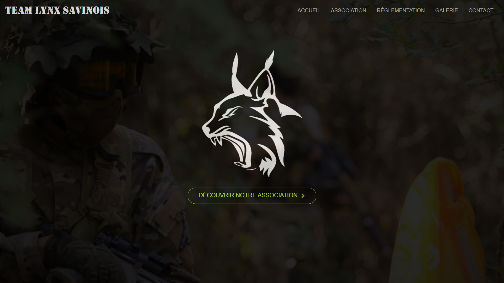
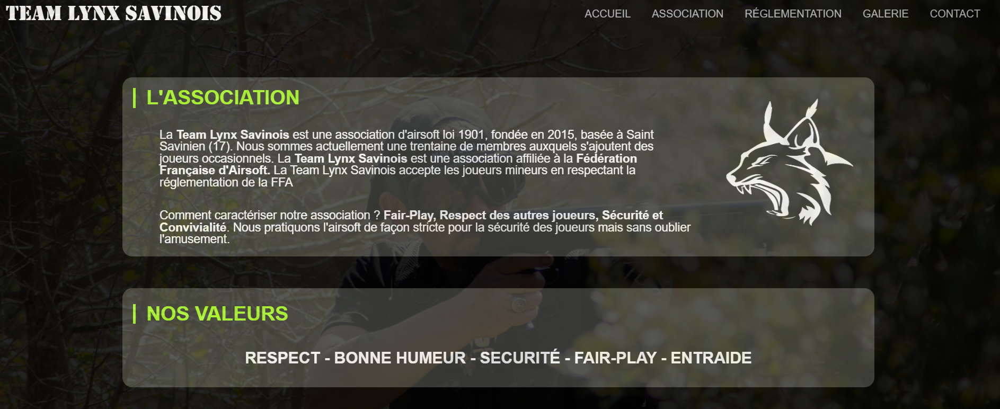
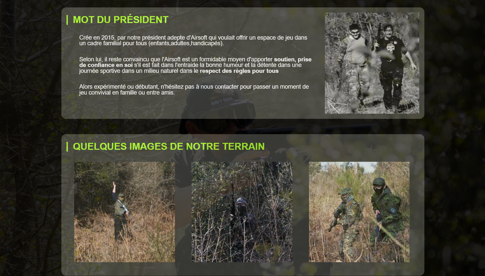
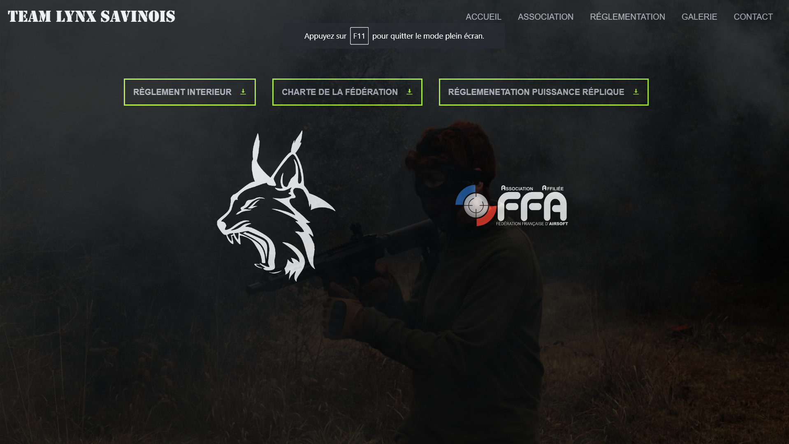
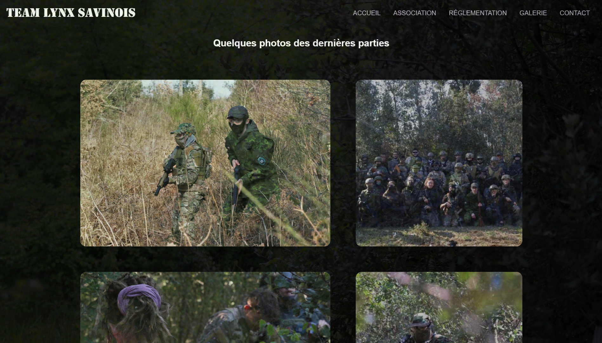
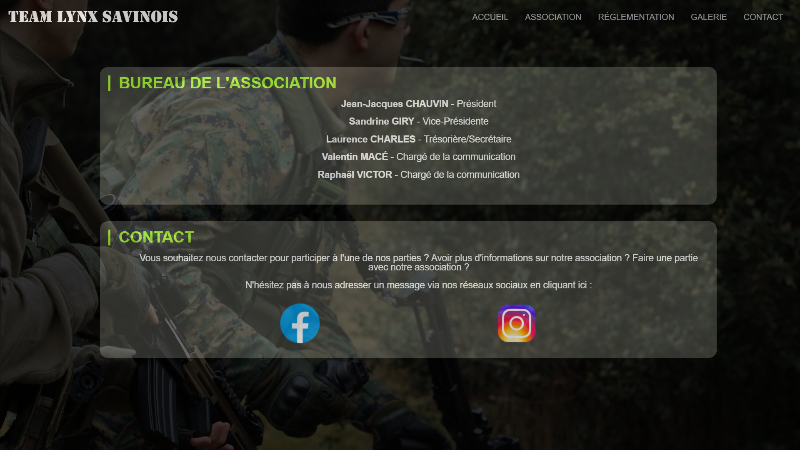

# TeamLynxSavinois

## Description

Ce projet a été réalisé pour une association d'airsoft nommé Team Lynx Savinois, association dont je fais parti en temps que chargé de la communication. 
 - Ce projet est encore en cours de développement.
L'idée de ce projet était de m'entraîner au développement web tout en donnant un site à l'association. Il y a une première version du site, ce repository est la deuxième version.
Pour faire le site, je me suis concerté avec le bureau de l'association et les membres pour récolter leurs idées et je me suis fait des tâches pour apprendre également l'organisation par tâche. Ce site est le fruit de toutes les idées proposés par les membres.

 - Le site présente notre association, nos valeurs, notre terrain de jeu et envoie vers les endroits pour nous contacter si la personne est intéressé. 
Egalement le site possède un espace uniquement administrateur avec un formulaire de connexion privé à moi et à l'autre chargé de la communication qui permet de modifier les photos de la galerie plus simplement.

## Ajouts possibles

Comme le projet est encore en cours de développement ces ajouts arriveront au fur et à mesure : 
  - Responsive total du site - Priorité
  - Test Git
  - Création d'un formulaire de connexion pour les licenciés de l'association pour qu'il est un espace pour chacun
  - Mise en place d'un module de participation dans l'espace des membres pour qu'il puisse indiquer leur participation aux parties où ils seront présents
  - Mise en place de l'espace admin pour pouvoir ajouter et retirer des informations à transmettre et ajouter le module de participation pour que tous les membres le voient
  - Mise en place d'un formulaire de contact directement sur le site pour aider les personnes n'ayant pas les réseaux sociaux où nous sommes présents
  - Amélioration du site pour qu'il rentre dans les normes d'éco-conception (images au format webp, amélioration du code)
  - Amélioration du site pour qu'il gagne en référencement
  - Actualisation technique du site grâce à mes nouvelles connaissances/ nouvelles techniques de développement

## Screenshots

### index.php

### association.php

### reglementation.php

### photo.php

### contact.php

## Auteurs

Ce projet a été réalise par moi-même en collaboration avec la Team Lynx Savinois
